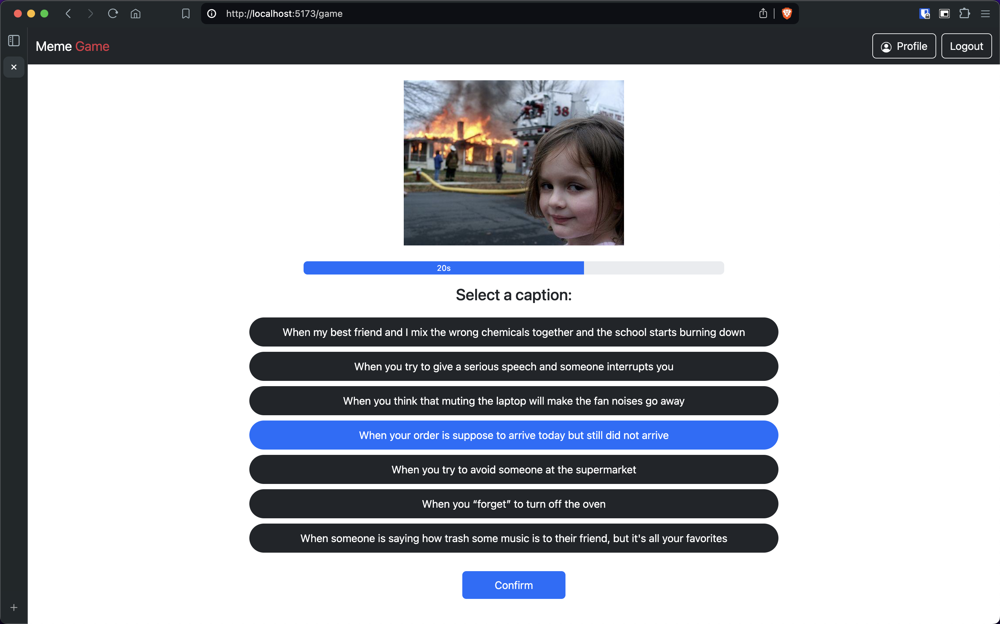
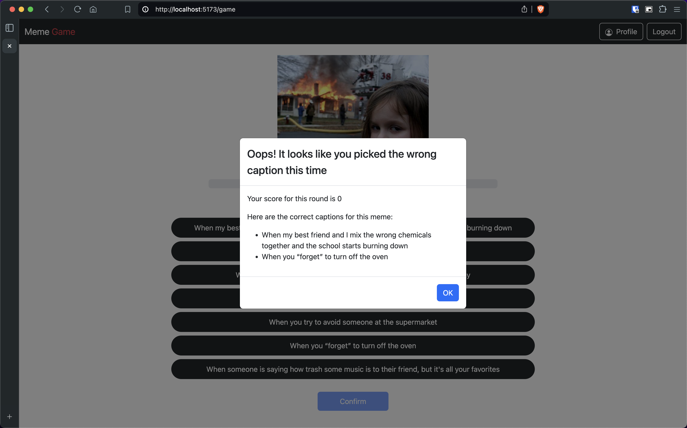

# Web Application Exam : "Meme Game"
## Student: s327473 Zenotto Andrea 

## React Client Application Routes

- Route `/`: homepage where the user can start a new game, or go to the login page via a specific button in the navbar
- Route `/login`: login page where the user can enter his credentials and authenticate
- Route `/game`: page where the user can play a game
- Route `/game/summary`: page where the logged in user sees a summary of the previous game played
- Route `/profile`: page where the logged in user sees a summary of his personal information and the history of games played

## API Server

- **POST** `/api/sessions` - Create a new session with the logged in user

  - Request Body:
    ```
    {
      username: 'user1',
      password: 'password'
    }
    ```
  - Response Status: `201` OK, `401` Unauthorized
  - Response Body:
    ```
    {
      id: number - User ID
      username: string - User email
      name: string - User name
      surname: string - User surname
      email: string - User email
    }
    ```
    <br />

- **GET** `/api/sessions/current` - Get the info about the current user

  - Request Body: **None**
  - Response Status: `200` OK, `401` Unauthorized
  - Response Body:
    ```
    {
      id: number - User ID
      username: string - User email
      name: string - User name
      surname: string - User surname
      email: string - User email
    }
    ```
    <br />

- **DELETE** `/api/session/current` - Delete the current session and logout the user
  - Prerequisite: User is logged in
  - Request Body: **None**
  - Response Status: `200` OK
  - Response Body: **None**
    <br />

- **GET** `/api/memes` - Get 3 memes to use in the game

  - Request Body: **None**
  - Response Status: `200` OK, `500` Internal Server Error
  - Response Body:
    ```
    {
      id: number - Meme ID
      memeUrl: string - Meme file location
    }
    ```
    <br />

- **GET** `/api/captions/:memeId` - Get 7 caption two of which correspond to the correct answer for the current meme

  - Request Body: **None**
  - Response Status: `200` OK, `500` Internal Server Error
  - Response Body:
    ```
    {
      id: number - Caption ID
      memeId: number - Meme ID
      caption: string - The sentence that forms the caption 
    }
    ```
    <br />

- **POST** `/api/game/:userId` - Get 7 caption two of which correspond to the correct answer for the current meme

  - Request Body: 
    ```
    {
      id: number - Game ID
      userId: number - User ID
      memeUrl1: string - The location of the image file of the meme selected in the round 1
      selectedCaption1: string - The selected caption in the round 1
      score1: number - The score of the round 1
      memeUrl2: string - The location of the image file of the meme selected in the round 2
      selectedCaption2: string - The selected caption in the round 2
      score2: number - The score of the round 2
      memeUrl3: string - The location of the image file of the meme selected in the round 3
      selectedCaption3: string - The selected caption in the round 3
      score3: number - The score of the round 3
    }
    ```
  - Response Status: `201` OK, `400` Bad Request, `500` Internal Server Error
  - Response Body:
    ```
    {
      id: number - Last Game ID
    }
    ```
    <br />

- **GET** `/api/games/:userId` - Get 7 caption two of which correspond to the correct answer for the current meme

  - Request Body: **None**
  - Response Status: `200` OK, `500` Internal Server Error
  - Response Body:
    ```
    {
      id: number - Game ID
      userId: number - User ID
      memeUrl1: string - The location of the image file of the meme selected in the round 1
      selectedCaption1: string - The selected caption in the round 1
      score1: number - The score of the round 1
      memeUrl2: string - The location of the image file of the meme selected in the round 2
      selectedCaption2: string - The selected caption in the round 2
      score2: number - The score of the round 2
      memeUrl3: string - The location of the image file of the meme selected in the round 3
      selectedCaption3: string - The selected caption in the round 3
      score3: number - The score of the round 3
    }
    ```

## Database Tables

- Table `Users` - contains the users  
   _**Columns**:_
  - `id`: integer - User ID (PK)
  - `username`: text - User username (PK)
  - `password`: text - User password
  - `salt`: text - Salt used to hash the password
  - `name`: text - User name
  - `surname`: text - User surname
  - `email`: text - User email
    <br />

- Table `Memes` - contains the memes  
   _**Columns**:_
  - `id`: integer - Meme ID (PK)
  - `imageUrl`: text - The location of the image file of the meme
    <br />

- Table `Captions` - contains the captions  
   _**Columns**:_
  - `id`: integer - Caption ID (PK)
  - `memeId`: integer - Meme ID
  - `caption`: text - The caption to be associated with a meme
    <br />

- Table `Games` - contains the Games of every user  
   _**Columns**:_
  - `id`: integer - Game ID (PK)
  - `userId`: integer - User ID (PK)
  - `memeUrl1`: text - The location of the image file of the meme selected in the round 1
  - `selectedCaption1`: text - The selected caption in the round 1
  - `score1`: integer - The score of the round 1
  - `memeUrl2`: text - The location of the image file of the meme selected in the round 2
  - `selectedCaption2`: text - The selected caption in the round 2
  - `score2`: integer - The score of the round 2
  - `memeUrl3`: text - The location of the image file of the meme selected in the round 3
  - `selectedCaption3`: text - The selected caption in the round 3
  - `score3`: integer - The score of the round 3

## Main React Components

- `NavHeader` (in `NavHeader.jsx`): is the component that renders the navigation bar of the application, shows the title and has different action if the user is logged in or not. 
  - **Not logged**: show on the right the login button
  - **Logged**: show on the right the profile and the logout buttons
- `LoginForm` (in `LoginForm.jsx`): is the component that renders a form to validate username and password fields.
- `Homepage` (in `Homepage.jsx`): is the component that renders a page which presents, in addition to a title and an image, a button that allows you to start a new game
- `GameBoard` (in `GameBoard.jsx`): is the component that renders the game interface presents the current meme, the seven captions to choose from, and a confirm button, along with a timer that ensures the response is given within 30 seconds. It also handles a modal that is displayed at the end of each round, distinguishing between logged-in and non-logged-in users, as the former must play three rounds while the latter only one.
- `SummaryComponent` (in `SummaryComponent.jsx`): is the component that renders a page to which the logged in user is redirected at the end of the three rounds, and which contains the summary of the three rounds played in the game just ended with total score and caption that the player has correctly associated with the memes.
- `HistoryComponent` (in `HistoryComponent.jsx`): is the component that renders a profile page which the logged in user can access from the appropriate button in the navbar, and which shows, in addition to some user information, the history of the games he has played.

## Screenshot


<br />


## Users Credentials

- Username: `user1`, Password: `password`
- Username: `user2`, Password: `password`
